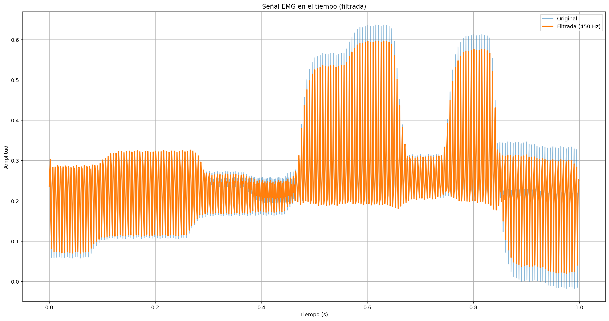
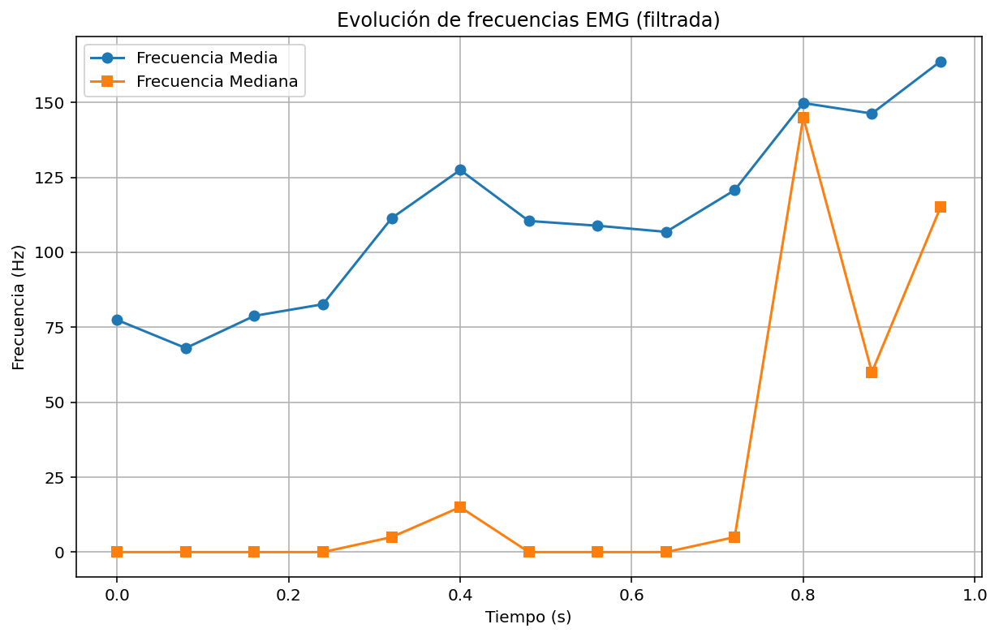
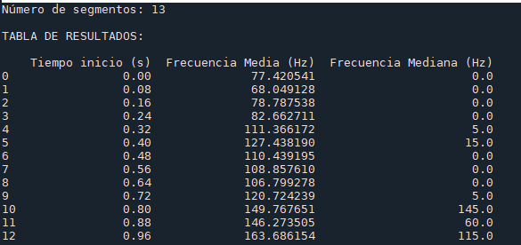

# Señales electromiográficas EMG 

## Asignatura

Procesamiento Digital de Señales

## Programa

Ingeniería Biomédica – Universidad Militar Nueva Granada

## Práctica de laboratorio

**Señales electromiográficas EMG**

## Integrantes

Danna Jimena Medina Ríos – Código 5600923
María José Polo Tovar – Código 5600894

---
## Descripción
Este repositorio contiene el desarrollo de la práctica de laboratorio "Señales electromiográficas EMG". El objetivo central fue identificar cambios en las características espectrales de una señal EMG cuando se alcanza la fatiga muscular. Se trabajó con dos tipos de señales: una señal emulada mediante un generador de señales biológicas (simulando aproximadamente 5 contracciones musculares voluntarias) y una señal real capturada sobre un voluntario sano mediante electrodos de superficie colocados en un grupo muscular (antebrazo o bíceps), registrando contracciones repetidas hasta alcanzar la fatiga. Cada señal fue procesada en Python aplicando un filtro pasa banda (20–450 Hz) y segmentada en las contracciones individuales para extraer parámetros clave como: frecuencia media y frecuencia mediana por contracción. Adicionalmente, se aplicó la Transformada Rápida de Fourier (FFT) a cada contracción para obtener el espectro de amplitud y analizar la evolución del contenido frecuencial a lo largo del ejercicio. Los resultados se compararon entre la señal emulada y la señal real, y se representaron gráficamente para evidenciar el desplazamiento espectral asociado a la aparición de la fatiga muscular.

----
##  Metodología 


---

## Diagrama de Flujo


---
### Parte A — Captura de la señal emulada
Se cargó la señal EMG desde el archivo EMG3.txt y se determinó una frecuencia de muestreo a partir de los intervalos de tiempo. Luego se aplicó un filtro pasa-bajos Butterworth de orden 4 con frecuencia de corte de 410 Hz, con el fin de eliminar ruido de alta frecuencia sin afectar el contenido muscular relevante. En la gráfica de la señal en el tiempo se puede observar que la señal filtrada (naranja) sigue fielmente la envolvente de la señal original (azul), confirmando que el filtro actuó correctamente sin distorsionar la forma de onda.

La señal filtrada fue dividida en segmentos usando una ventana de 0.2 s con paso de 0.08 s generando un solapamiento efectivo, obteniendo así un análisis temporal progresivo de la actividad muscular a lo largo del registro.
Para cada segmento se aplicó la FFT y se calcularon dos parámetros espectrales. La frecuencia media pondera las frecuencias por su magnitud espectral, mientras que la frecuencia mediana divide el espectro en dos mitades de igual energía acumulada. Ambos parámetros son indicadores clásicos de fatiga muscular: en condiciones de fatiga, se espera un desplazamiento hacia frecuencias más bajas.

```python
import numpy as np
import matplotlib.pyplot as plt
import pandas as pd
from scipy.fft import fft, fftfreq
from scipy.signal import butter, filtfilt


# CARGA DE DATOS PARTE A

data = np.loadtxt("EMG3.txt", skiprows=1)

t = data[:, 0]
x = data[:, 1]

fs = int(1 / (t[1] - t[0]))  # frecuencia de muestreo
print("Frecuencia de muestreo:", fs)
print("Duración de la señal:", t[-1] - t[0])


# FILTRO PASA-BAJOS 410 Hz

fc = 410  # frecuencia de corte
orden = 4

w = fc / (fs / 2)  # normalización

b, a = butter(orden, w, btype='low')

x_filtrada = filtfilt(b, a, x)


#GRAFICA SEÑAL

plt.figure(figsize=(20,10))
plt.plot(t, x, label="Original", alpha=0.5)
plt.plot(t, x_filtrada, label="Filtrada (450 Hz)", linewidth=2)
plt.xlabel("Tiempo (s)")
plt.ylabel("Amplitud")
plt.title("Señal EMG en el tiempo (filtrada)")
plt.legend()
plt.grid()
plt.show()


#  VENTANAS DESLIZANTES

ventana_seg = 0.2
paso_seg = 0.08

ventana = int(ventana_seg * fs)
paso = int(paso_seg * fs)

segmentos = []

for i in range(0, len(x_filtrada), paso):
    fin = i + ventana

    if fin > len(x_filtrada):
        fin = len(x_filtrada)

    segmentos.append((i, fin))

print("Número de segmentos:", len(segmentos))


# FRECUENCIA MEDIA Y MEDIANA

f_media = []
f_mediana = []
tiempos_inicio = []

for seg in segmentos:
    xi = x_filtrada[seg[0]:seg[1]]

    if len(xi) < 10:
        continue

    t_inicio = t[seg[0]]

    # zero-padding si la ventana es incompleta
    if len(xi) < ventana:
        xi = np.pad(xi, (0, ventana - len(xi)))

    N = len(xi)

    X = np.abs(fft(xi))
    freqs = fftfreq(N, 1/fs)

    freqs = freqs[:N//2]
    X = X[:N//2]

    if np.sum(X) == 0:
        continue

    # Frecuencia media
    fm = np.sum(freqs * X) / np.sum(X)

    # Frecuencia mediana
    acumulada = np.cumsum(X)
    mitad = acumulada[-1] / 2
    fmed = freqs[np.where(acumulada >= mitad)[0][0]]

    tiempos_inicio.append(t_inicio)
    f_media.append(fm)
    f_mediana.append(fmed)


# TABLA

tabla = pd.DataFrame({
    "Tiempo inicio (s)": tiempos_inicio,
    "Frecuencia Media (Hz)": f_media,
    "Frecuencia Mediana (Hz)": f_mediana
})

print("\nTABLA DE RESULTADOS:\n")
print(tabla)


#  EVOLUCIÓN DE FRECUENCIAS

plt.figure(figsize=(10,6))

plt.plot(tabla["Tiempo inicio (s)"], tabla["Frecuencia Media (Hz)"], 'o-', label="Frecuencia Media")
plt.plot(tabla["Tiempo inicio (s)"], tabla["Frecuencia Mediana (Hz)"], 's-', label="Frecuencia Mediana")

plt.xlabel("Tiempo (s)")
plt.ylabel("Frecuencia (Hz)")
plt.title("Evolución de frecuencias EMG (filtrada)")
plt.legend()
plt.grid()

plt.show()
 ```
<p align="center">
  
</p>

<p align="center">
  <em> Señal EMG en el tiempo (filtrada) </em>
</p>

<p align="center">
  
</p>

<p align="center">
  <em> Evolución de frecuencias EMG (filtrada) </em>
</p>

<p align="center">
  
</p>

<p align="center">
  <em> Tabla de resultados </em>
</p>

---

### Parte B - Captura de la señal de paciente

---
### Parte C - Análisis espectral mediante FFT

