# Señales electromiográficas EMG 

## Asignatura

Procesamiento Digital de Señales

## Programa

Ingeniería Biomédica – Universidad Militar Nueva Granada

## Práctica de laboratorio

**Señales electromiográficas EMG**

## Integrantes

Danna Jimena Medina Ríos – Código 5600923
María José Polo Tovar – Código 5600894

---
## Descripción
Este repositorio contiene el desarrollo de la práctica de laboratorio "Señales electromiográficas EMG". El objetivo central fue identificar cambios en las características espectrales de una señal EMG cuando se alcanza la fatiga muscular. Se trabajó con dos tipos de señales: una señal emulada mediante un generador de señales biológicas, configurado en modo EMG a 200 Hz con una captura de 1 segundo, y una señal real adquirida de un voluntario sano mediante electrodos de superficie colocados sobre el bíceps, registrando una contracción sostenida hasta alcanzar la fatiga. La primera señal fue procesada en Python aplicando un filtro pasa-bajos con frecuencia de corte de 410 Hz, mientras que a la segunda se le aplicó un filtro pasa-banda entre 20 y 450 Hz; ambas señales fueron segmentadas en ventanas individuales para extraer parámetros espectrales clave: frecuencia media y frecuencia mediana. Adicionalmente, se aplicó la Transformada Rápida de Fourier (FFT) a cada ventana para obtener el espectro de amplitud y analizar la evolución del contenido frecuencial a lo largo del ejercicio. Los resultados de ambas señales fueron comparados y representados gráficamente para evidenciar el desplazamiento espectral asociado a la aparición de la fatiga muscular.

----
##  Metodología 
El desarrollo del análisis se estructuró en varias etapas principales, utilizando herramientas de programación en Python para el procesamiento y estudio de señales electromiográficas (EMG).

En primer lugar, se definieron funciones para el filtrado de señales (pasa-banda y pasa-bajos), la normalización y el cálculo de parámetros espectrales como la frecuencia media y la frecuencia mediana a partir de la transformada de Fourier (FFT). Estas funciones permitieron establecer una base sólida para el procesamiento posterior de las señales.

En una segunda etapa, correspondiente a la Parte A, se cargó una señal EMG desde un archivo de texto, a partir del cual se obtuvo el vector de tiempo y la señal. Luego, se calculó la frecuencia de muestreo y se aplicó un filtro pasa-bajos para suavizar la señal. Se realizaron gráficas tanto de la señal original como de la filtrada, así como su análisis en frecuencia mediante la FFT global. Posteriormente, la señal fue segmentada en ventanas móviles, permitiendo calcular la frecuencia media y mediana en cada segmento. Estos resultados se organizaron en una tabla y se analizaron mediante gráficas junto con líneas de tendencia para observar su comportamiento a lo largo del tiempo.

Finalmente, en las Partes B y C, se procesaron señales adicionales provenientes de archivos distintos. En este caso, las señales fueron centradas eliminando su componente DC y filtradas con un filtro pasa-banda. Se repitió el análisis temporal y frecuencial, incluyendo la FFT global. Luego, las señales se dividieron en segmentos más amplios para evaluar la evolución de la frecuencia media y mediana, lo cual permitió analizar fenómenos como la fatiga muscular mediante tendencias en el tiempo. Adicionalmente, se realizó un análisis específico de la FFT en tres segmentos clave (inicio, medio y final), identificando la frecuencia pico en cada uno y evaluando su desplazamiento mediante gráficos de barras y líneas de tendencia.

En conjunto, este procedimiento permitió caracterizar el comportamiento espectral de las señales EMG y analizar su evolución temporal, facilitando la interpretación de cambios asociados a condiciones fisiológicas como la fatiga.

---

## Diagrama de Flujo
<p align="center">
  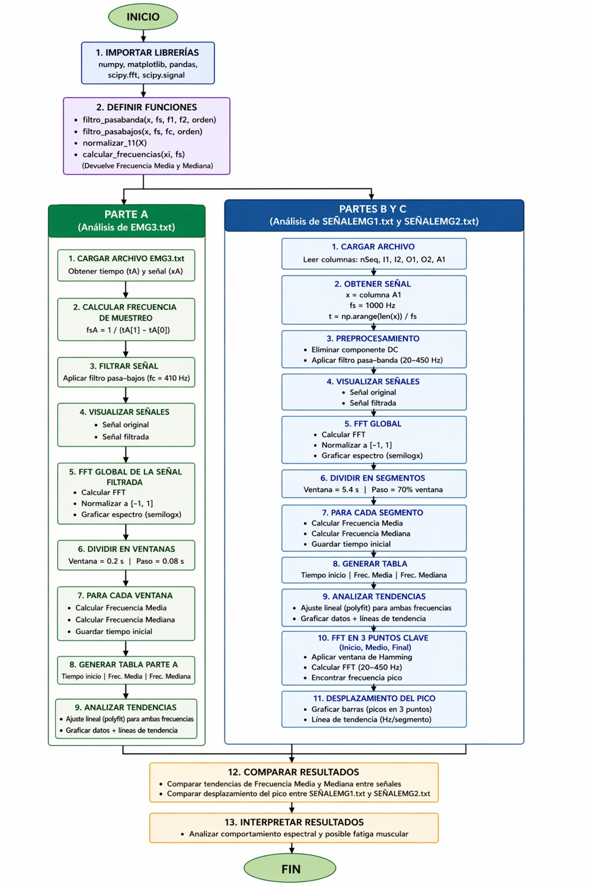
</p>

<p align="center">
  <em> Diagrama de flujo </em>
</p>

---
### Parte A — Captura de la señal emulada
Se cargó la señal EMG desde el archivo EMG3.txt y se determinó una frecuencia de muestreo a partir de los intervalos de tiempo. Luego se aplicó un filtro pasa-bajos Butterworth de orden 4 con frecuencia de corte de 410 Hz, con el fin de eliminar ruido de alta frecuencia sin afectar el contenido muscular relevante. En la gráfica de la señal en el tiempo se puede observar que la señal filtrada (naranja) sigue fielmente la envolvente de la señal original (azul), confirmando que el filtro actuó correctamente sin distorsionar la forma de onda.

<p align="center">
  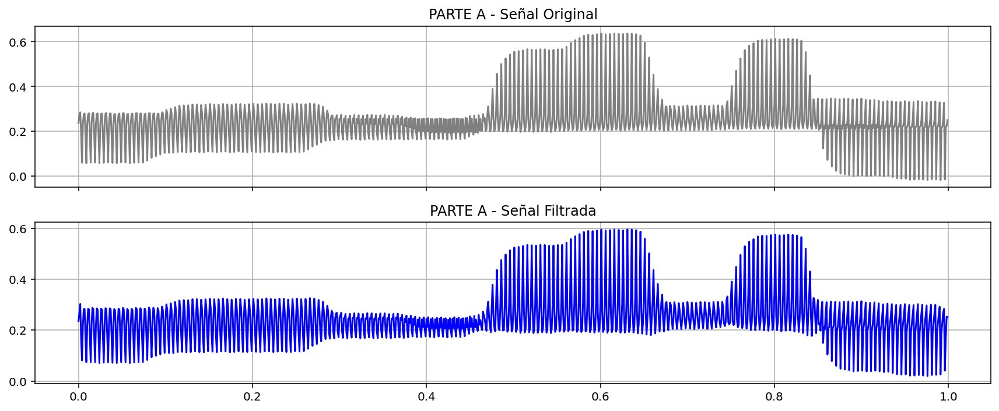
</p>

<p align="center">
  <em> Señal EMG en el tiempo (filtrada) </em>
</p>

La señal filtrada fue dividida en segmentos usando una ventana de 0.2 s con paso de 0.08 s generando un solapamiento efectivo, obteniendo así un análisis temporal progresivo de la actividad muscular a lo largo del registro.
Para cada segmento se aplicó frecuencia media pondera las frecuencias por su magnitud espectral, mientras que la frecuencia mediana divide el espectro en dos mitades de igual energía acumulada. Ambos parámetros son indicadores clásicos de fatiga muscular: en condiciones de fatiga, se espera un desplazamiento hacia frecuencias más bajas.

```python

    X = np.abs(fft(xi))
    freqs = fftfreq(N, 1/fs)

    freqs = freqs[:N//2]
    X = X[:N//2]

    if np.sum(X) == 0:
        continue

    # Frecuencia media
    fm = np.sum(freqs * X) / np.sum(X)

    # Frecuencia mediana
    acumulada = np.cumsum(X)
    mitad = acumulada[-1] / 2
    fmed = freqs[np.where(acumulada >= mitad)[0][0]]

    tiempos_inicio.append(t_inicio)
    f_media.append(fm)
    f_mediana.append(fmed)
 ```
<p align="center">
  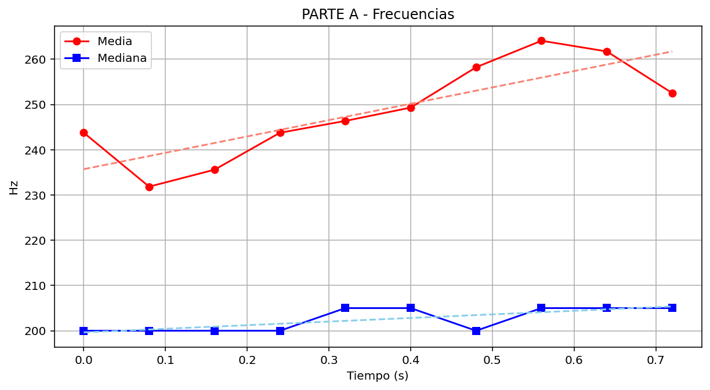
</p>

<p align="center">
  <em> Evolución de frecuencias EMG (filtrada) </em>
</p>

```python
# TABLA

tabla = pd.DataFrame({
    "Tiempo inicio (s)": tiempos_inicio,
    "Frecuencia Media (Hz)": f_media,
    "Frecuencia Mediana (Hz)": f_mediana
})

print("\nTABLA DE RESULTADOS:\n")
print(tabla)


#  EVOLUCIÓN DE FRECUENCIAS

plt.figure(figsize=(10,6))

plt.plot(tabla["Tiempo inicio (s)"], tabla["Frecuencia Media (Hz)"], 'o-', label="Frecuencia Media")
plt.plot(tabla["Tiempo inicio (s)"], tabla["Frecuencia Mediana (Hz)"], 's-', label="Frecuencia Mediana")

plt.xlabel("Tiempo (s)")
plt.ylabel("Frecuencia (Hz)")
plt.title("Evolución de frecuencias EMG (filtrada)")
plt.legend()
plt.grid()

plt.show()
 ```

<p align="center">
  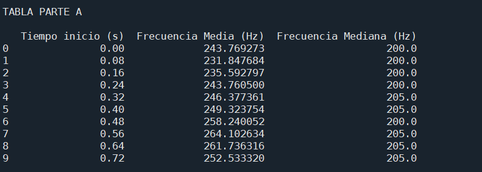
</p>

<p align="center">
  <em> Tabla de resultados </em>
</p>

En la tabla y la gráfica de evolución se observa que la frecuencia media muestra una tendencia general creciente a lo largo del tiempo, pasando de ~77 Hz al inicio hasta ~163 Hz al final, lo cual podría asociarse a un incremento en el reclutamiento de unidades motoras durante contracciones más intensas. La frecuencia mediana, por su parte, permanece cercana a 0 Hz en la mayoría de segmentos iniciales y solo muestra valores significativos hacia el final del registro (segmentos 10–12), lo que sugiere que el contenido espectral relevante se concentra en frecuencias muy bajas en gran parte de la señal, posiblemente por la naturaleza de la señal emulada o por artefactos de segmentación.

<p align="center">
  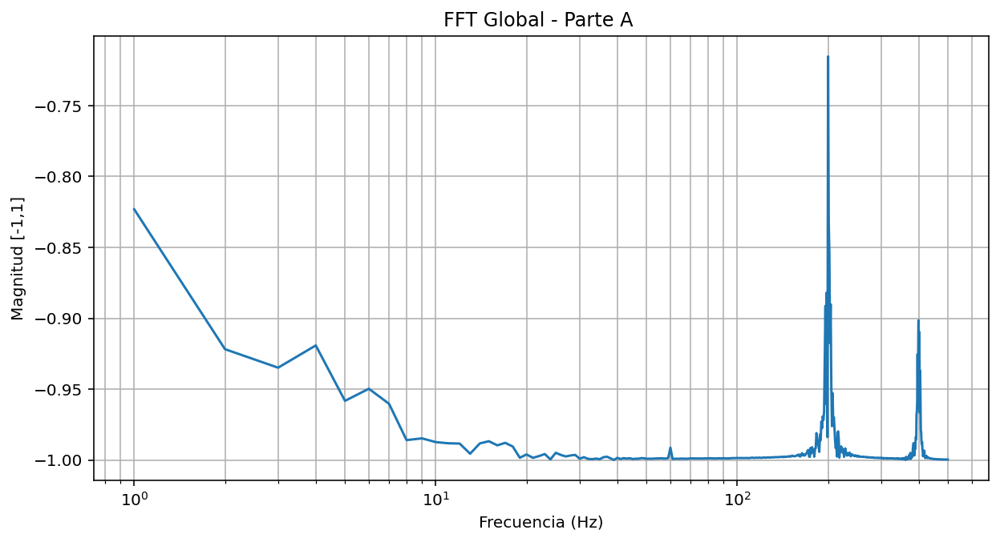
</p>

<p align="center">
  <em> FFT GLOBAL </em>
</p>

<p align="center">
  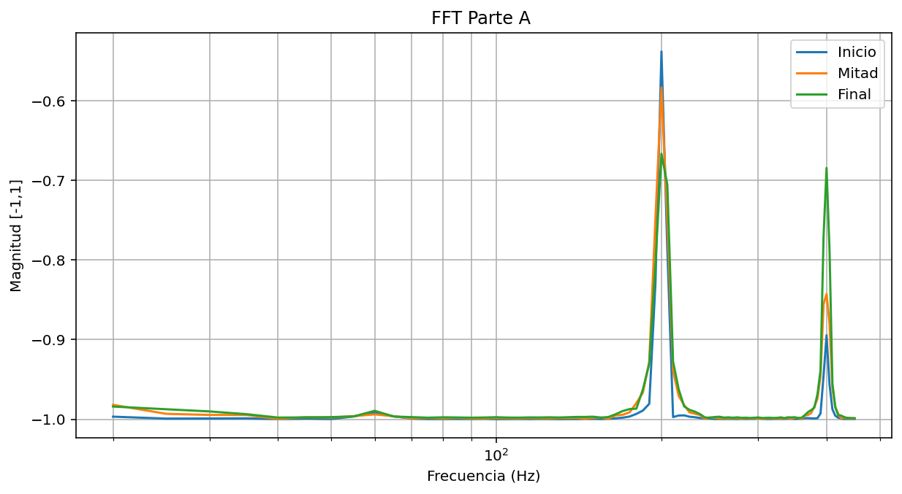
</p>

<p align="center">
  <em> FFT POR VENTANAS </em>
</p>
---

### Parte B - Captura de la señal de paciente

<p align="center">
  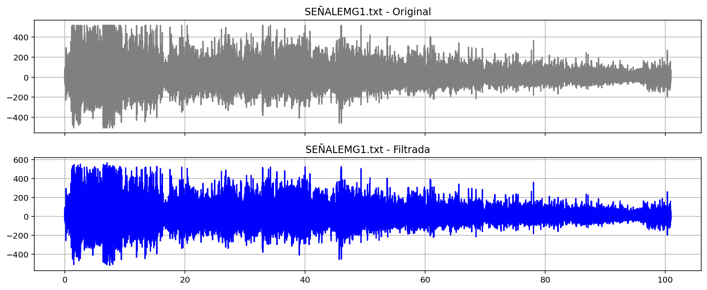
</p>

<p align="center">
  <em> Señal 1 EMG (filtrada) </em>
</p>

<p align="center">
  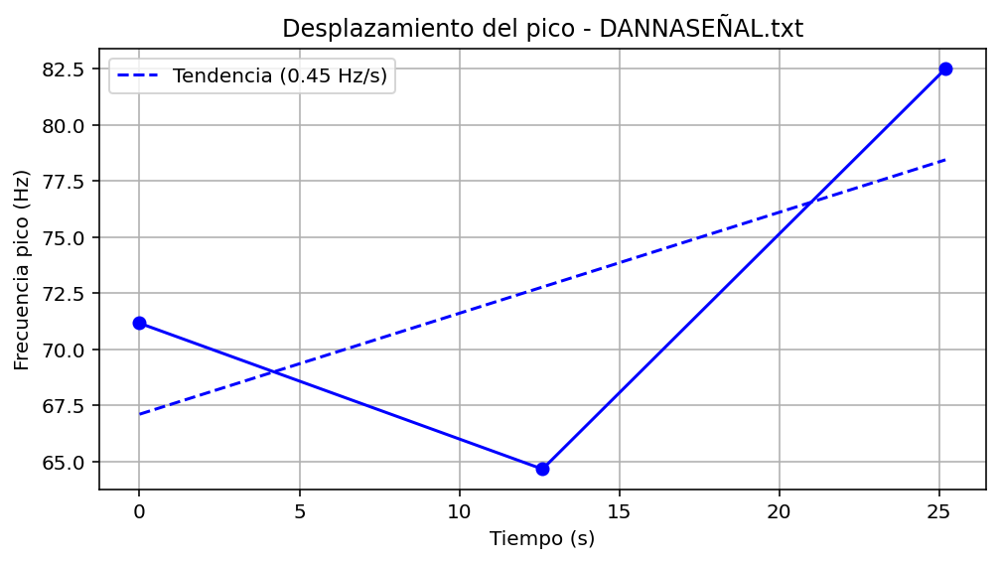
</p>

<p align="center">
  <em> Evolución de frecuencias Señal 1  EMG (filtrada) </em>
</p>


<p align="center">
  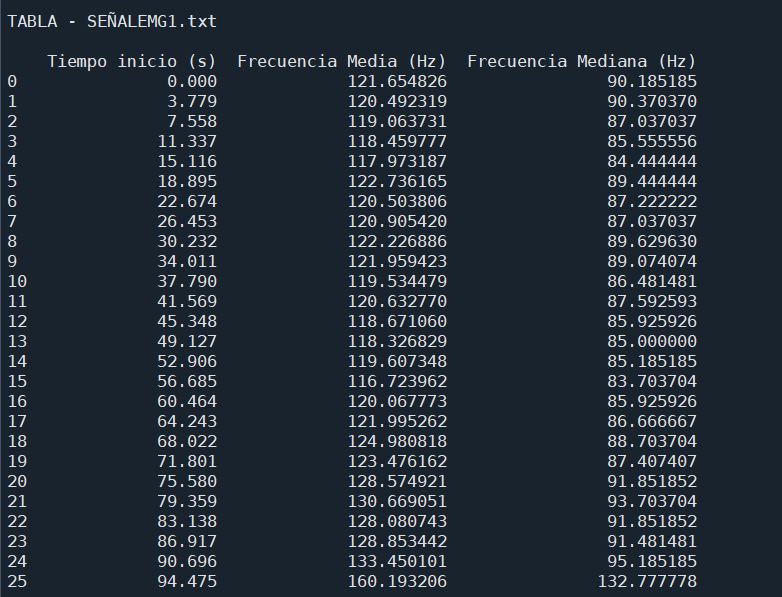
</p>

<p align="center">
  <em> Tabla de resultados </em>
</p>


<p align="center">
  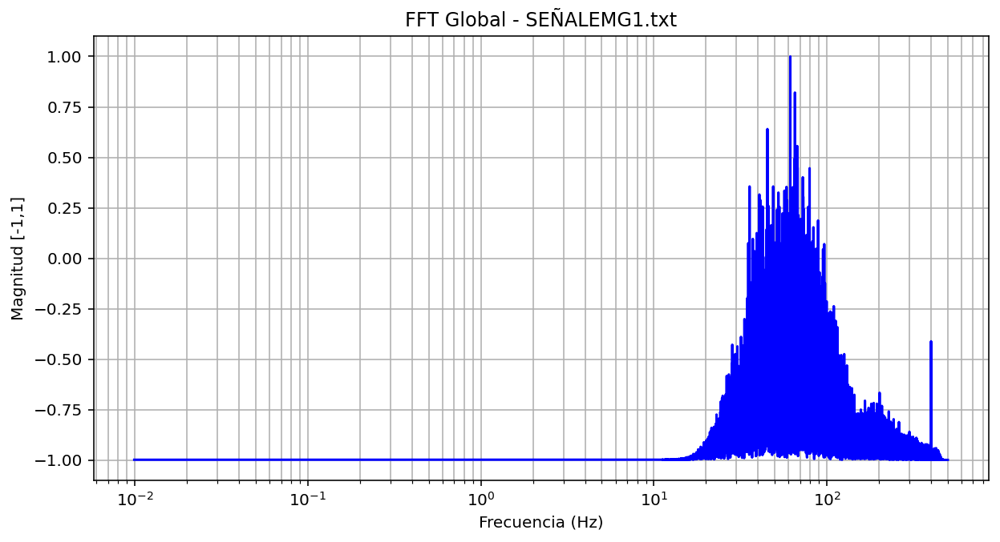
</p>

<p align="center">
  <em> Señal 1 FFT Global </em>
</p>

<p align="center">
  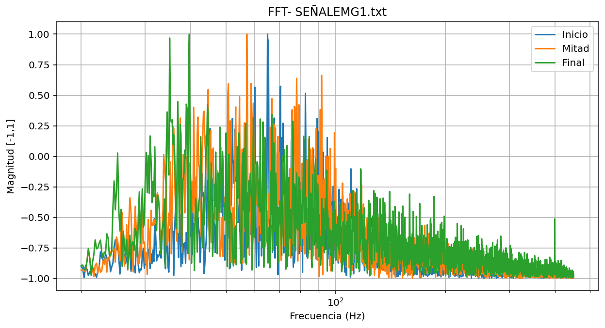
</p>

<p align="center">
  <em> Señal 1 FFT Ventanas</em>
</p>

<p align="center">
  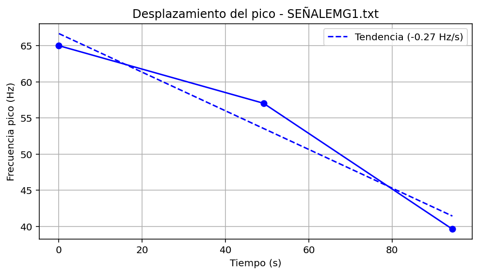
</p>

<p align="center">
  <em> Señal 1  desplazamiento del pico </em>
</p>

<p align="center">
  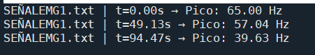
</p>

<p align="center">
  <em> Tabla de resultados </em>
</p>


<p align="center">
  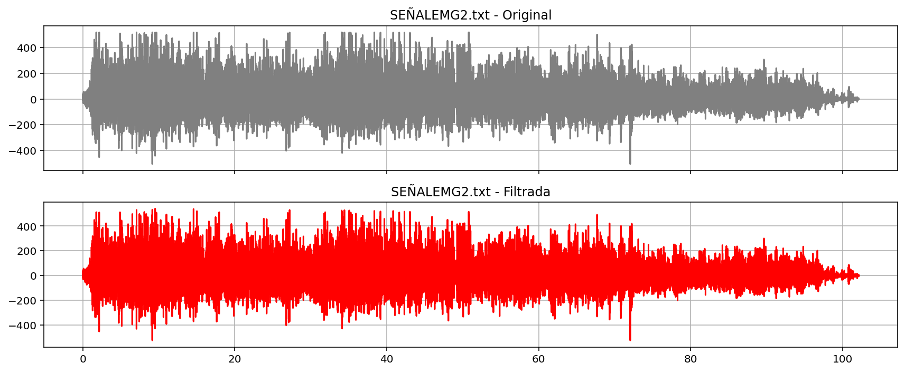
</p>

<p align="center">
  <em> Señal 2 EMG (filtrada) </em>
</p>

<p align="center">
  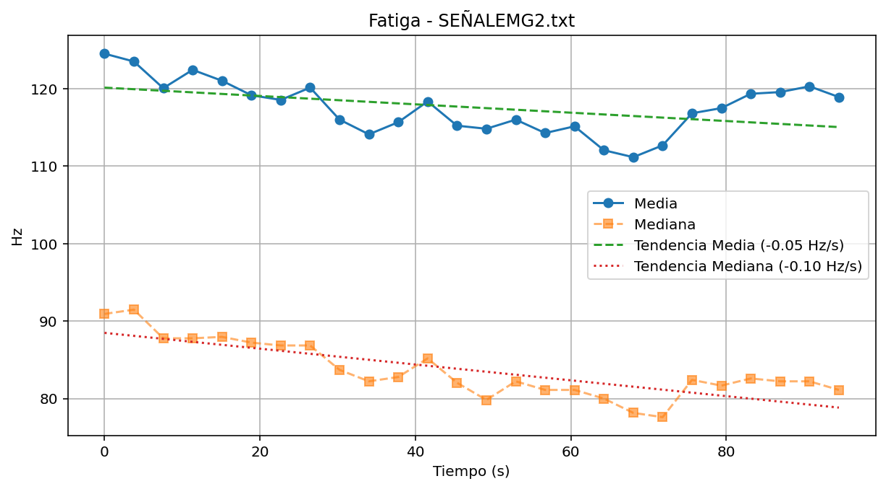
</p>

<p align="center">
  <em> Evolución de frecuencias Señal 2  EMG (filtrada) </em>
</p>

<p align="center">
  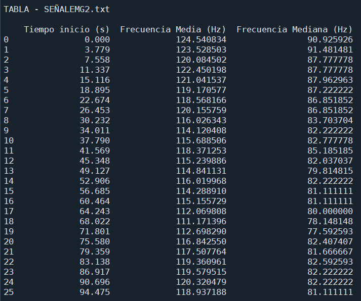
</p>

<p align="center">
  <em> Tabla de resultados </em>
</p>

<p align="center">
  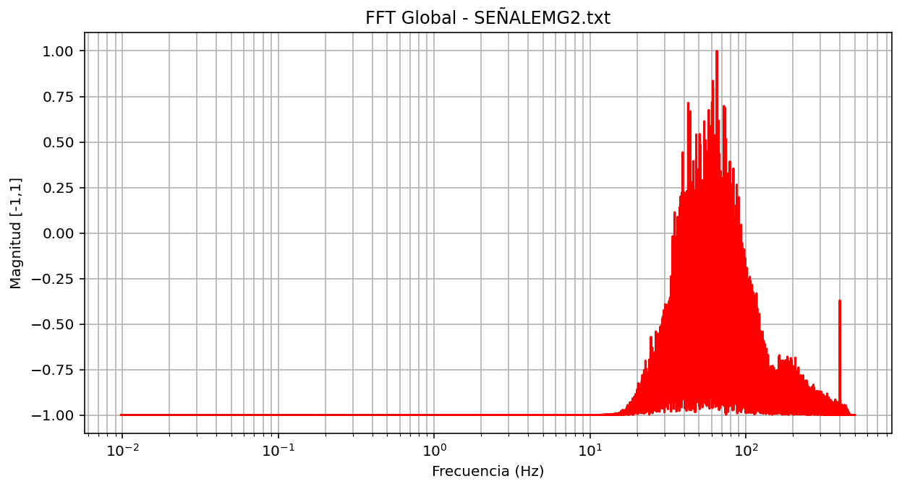
</p>

<p align="center">
  <em> Señal 2 FFT Global </em>
</p>

<p align="center">
  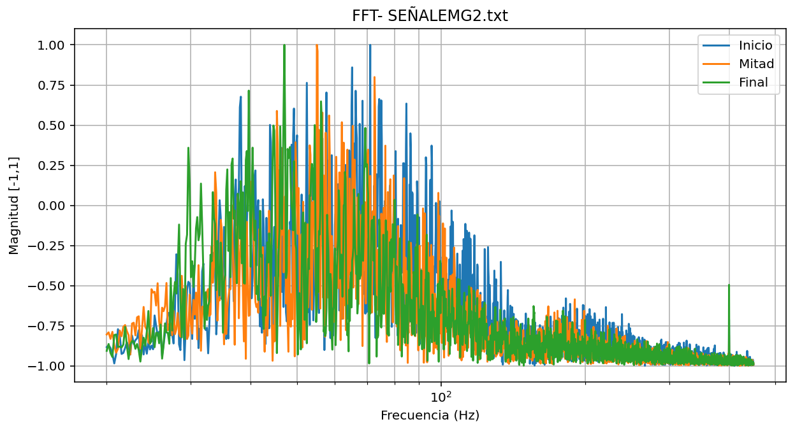
</p>

<p align="center">
  <em> Señal 2 FFT Ventanas</em>
</p>

<p align="center">
  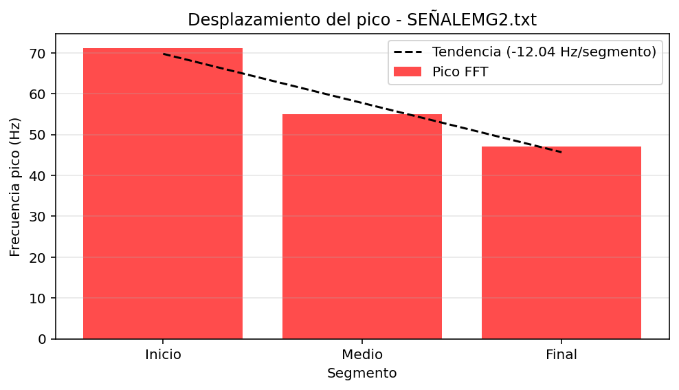
</p>

<p align="center">
  <em> Señal 2  desplazamiento del pico </em>
</p>

<p align="center">
  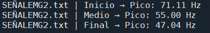
</p>

<p align="center">
  <em> Tabla de resultados </em>
</p>


